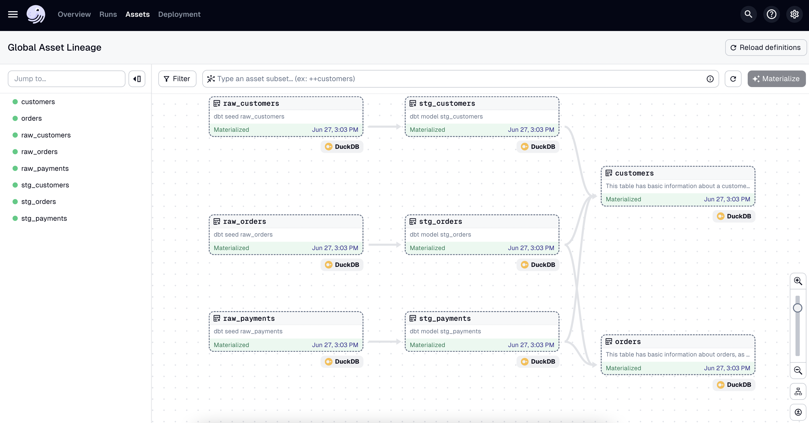

# Dasgter "Airlift" Demo

The Dagster "airlift" project is an early-stage project to showcase Dagster can server as an operational control plane for assets that are orchestrated in _and outside_ of Dagster.

In this example, the boilerplate dbt project `jaffle_shop_duckdb` is loaded into Dagster _as a set of externally managed assets_, see the code in `definitions.py`. 

These assets are then invoked by some other system, in this case `python run_dbt.py`. The `run_dbt.py` code does not import dagster in anyway, a simple REST interface is used to report metadata back to dagster when the dbt models are run. 

The result allows Dagster to provide full lineage across a broader set of assets, while still collecting operational metadata. Not shown in this example, but downstream native dagster assets could easily be orchestrated as a response to these external runs.

*external assets represented in the dagster asset graph* 

*runtime metadata for the external assets in the dagster asset graph*

